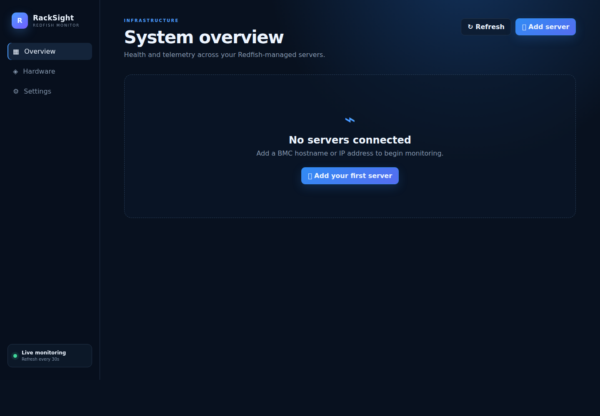
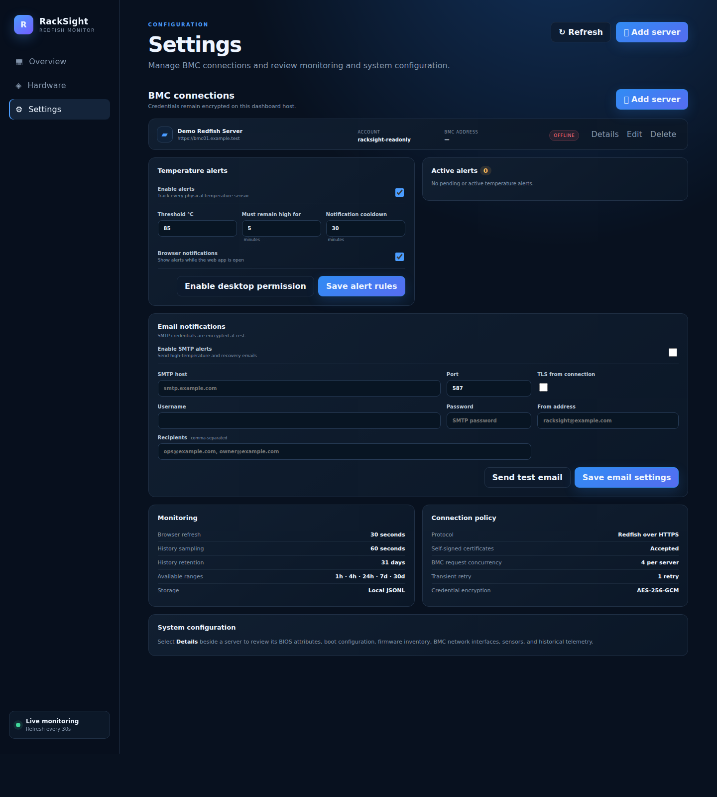

# RackSight

An AuthorityGate project
Copyright (c) 2026 AuthorityGate

[](https://github.com/AuthorityGate/RackSight/releases/tag/v1.1.4)
[](LICENSE)
[](#installation)
[](COMPATIBILITY.md)

RackSight is a local-first hardware monitoring and alerting dashboard for servers with a Redfish-capable BMC. It brings mixed-vendor health, inventory, temperatures, fans, history, and sustained-temperature alerts into one simple desktop application or internal web service.



## What it monitors

- Overall server health and power state
- Processor and DIMM inventory
- CPU and memory utilization when the BMC exposes it
- Physical temperature sensors and maximum temperature
- Fan presence, speed, and health
- BIOS, BMC, and component firmware inventory
- Boot, BIOS, and BMC network settings
- Persistent 1-hour, 4-hour, 24-hour, 7-day, and 30-day charts
- Configurable sustained-temperature alerts
- Browser, native Windows, and encrypted SMTP notifications

RackSight reads BMC data; it does not change BIOS, boot, fan-control, or firmware settings.

## Compatibility

RackSight follows standard Redfish links and handles legacy `Thermal`, modern `ThermalSubsystem`, `EnvironmentMetrics`, chassis `Sensors`, and expanded collection members. It was developed and tested against three ASRock Rack B650D4U-2L2T/BCM systems and is expected to work with standards-compliant implementations from:

- ASRock Rack AST2500/AST2600
- Dell PowerEdge iDRAC7, iDRAC8, and iDRAC9
- HPE ProLiant iLO4, iLO5, iLO6, and iLO7
- Lenovo ThinkSystem XCC and XCC2
- Supermicro X10/H11 and newer generations
- Cisco UCS C-Series CIMC
- Fujitsu PRIMERGY/PRIMEQUEST iRMC S5 and S6
- IBM Power and generic OpenBMC/bmcweb platforms

See the [compatibility matrix](COMPATIBILITY.md) for model families, test status, firmware caveats, required Redfish resources, and official vendor references. “Expected” compatibility is not the same as AuthorityGate lab validation.

## Installation

### Windows desktop application

Download the signed installer from [GitHub Releases](https://github.com/AuthorityGate/RackSight/releases/tag/v1.1.4):

- `RackSight-Setup-1.1.4-x64.exe` — guided system-wide installation to `C:\Program Files\AuthorityGate\RackSight`

Both files are Authenticode-signed by **AUTHORITYGATE INC** and timestamped by GlobalSign. Verify the signature before running the application. See the complete [Windows installation guide](docs/INSTALL-WINDOWS.md).

Closing the desktop window keeps RackSight running in the Windows notification area. Use the tray menu to quit and stop monitoring.

The installer automatically prefills company name from Windows computer registration or domain information, allows correction, requires an email address, and makes one best-effort request to `license.authoritygate.com` containing only those values, the computer FQDN, and the installed app version. RackSight has no license key, activation, feature restriction, or ongoing network requirement. If registration cannot be reached, installation continues normally.

Installed builds check the public GitHub Releases feed at startup. Settings displays the installed version, last check, result, and a **Check for updates** action. When a newer signed release exists, users can upgrade, read its changelog, or defer. Updates preserve application configuration, encrypted credentials, and all retained telemetry history, and RackSight creates a local data backup before installing an update.

### Centralized IIS deployment

Requirements:

- Windows Server with IIS
- Node.js 22 or newer (a current supported LTS release is recommended)
- IIS URL Rewrite and Application Request Routing
- Network access from the RackSight host to each BMC
- Redfish enabled on each BMC
- A dedicated read-only BMC account where supported

For centralized viewing, run the RackSight service on loopback and publish it exclusively through an authenticated IIS HTTPS site. IIS provides the user-facing URL, TLS certificate, authentication, and access controls; the Node.js process performs Redfish collection, history, and alerting.

Do not expose the Node.js listener directly or bind it to a LAN interface. See [Centralized IIS installation](docs/INSTALL-IIS.md) for the supported topology, required IIS modules, service environment, reverse-proxy rule, authentication, storage, and upgrade guidance.

RackSight releases are built and tested with Node.js 24. Node.js 22 is the minimum supported runtime for centralized IIS deployments.

## First-run configuration

1. Add each BMC by FQDN or IP address.
2. Use a descriptive display name and a least-privilege account.
3. Confirm the Overview and Hardware pages populate as expected.
4. Open Settings and choose a physical temperature threshold and required duration.
5. Enable Windows/browser notifications if desired.
6. Configure SMTP and send a test message before enabling email alerts.
7. Leave RackSight running so history and alerts continue collecting.



## Historical telemetry

The service polls configured BMCs every 60 seconds, including when no browser window is open. Compact snapshots are stored in `data/history/<server-id>.jsonl` and retained for 31 days.

| Range | Display resolution | Bucket values |
| --- | --- | --- |
| 1 hour | 1 minute | Average + peak |
| 4 hours | 2 minutes | Average + peak |
| 24 hours | 5 minutes | Average + peak |
| 7 days | 30 minutes | Average + peak |
| 30 days | 2 hours | Average + peak |

Every point is calculated from the raw samples inside its time bucket. Solid chart lines show the bucket average and matching dashed lines show its peak, so longer ranges preserve short temperature, fan, utilization, and fan-control spikes.

Electron uses a 60-second collection interval. For IIS deployments, configure `HISTORY_INTERVAL_MS` in the managed RackSight service environment; the minimum is 30 seconds.

Example value: `HISTORY_INTERVAL_MS=60000`.

History starts when this version begins collecting and cannot reconstruct earlier telemetry.

## Alerts and SMTP

Temperature alerts apply only to physical Redfish temperature sensors. Synthetic values such as ASRock's `FSC_INDEX` are excluded. A sensor must remain above the configured threshold for the full duration before RackSight fires an alert.

Alerts can produce:

- Browser notifications while the page is open
- Native Windows notifications while Electron runs in the tray
- SMTP high-temperature and recovery messages
- Persistent fired/recovery records in `alert-events.jsonl`

SMTP passwords are encrypted at rest. Alert delivery is best-effort and requires the process to remain running; RackSight is not a safety controller.

## Credential and data storage

BMC and SMTP passwords never return to the browser after saving. RackSight encrypts them with AES-256-GCM. IIS deployments use the persistent directory assigned with `RACKSIGHT_DATA_DIR`; Electron uses the current user's RackSight application-data directory.

For a reproducible IIS deployment, configure a persistent `DASHBOARD_SECRET` in the managed service environment. Do not place the value in `web.config` or source control.

Do not change or lose the secret while encrypted records exist. Never commit `data/`, `master.key`, encrypted credential stores, diagnostic exports, or screenshots containing private infrastructure identifiers.

Most BMCs use self-signed certificates, which RackSight accepts by default. Set `ALLOW_SELF_SIGNED=false` to require a certificate trusted by the RackSight host.

## Redfish differences

Inventory, health, and temperatures are widely available. CPU and memory workload utilization are optional Redfish/OEM telemetry. RackSight displays `N/A` instead of estimating missing metrics.

The tested B650D4U BMC publishes sensor and inventory data but not host workload utilization. Use an operating-system or hypervisor integration such as vCenter/ESXi performance metrics when workload history is required.

AMI firmware places `FSC_INDEX` in the Redfish temperature collection even though it is a fan-speed-control index. RackSight displays it separately and excludes it from maximum-temperature calculations and alerts.

## Documentation

- [Compatibility matrix](COMPATIBILITY.md)
- [Windows installation](docs/INSTALL-WINDOWS.md)
- [Centralized IIS installation](docs/INSTALL-IIS.md)
- [Architecture and data flow](docs/ARCHITECTURE.md)
- [Local API](docs/API.md)
- [Troubleshooting](docs/TROUBLESHOOTING.md)
- [Security policy](SECURITY.md)
- [Changelog](CHANGELOG.md)
- [Contribution and branch policy](CONTRIBUTING.md)

## Development and packaging

```bash
npm ci
npm test
npm run electron
```

Build the Windows installer and portable executable:

```bash
npm run dist:win
```

Windows release builds are configured to use the AuthorityGate EV code-signing certificate in the Windows certificate store. The hardware signing token must be connected. Do not distribute an unsigned build as an AuthorityGate release.

## Repository policy

AuthorityGate maintains exactly two branches: `main` is stable/default and `Dev` is active development. External pull requests are not accepted and are closed automatically. See [CONTRIBUTING.md](CONTRIBUTING.md).

## License, warranty, and support

RackSight is licensed under the [MIT License](LICENSE). It is provided **as is**, without warranty or guarantee of any kind. AuthorityGate provides no support commitment, service-level agreement, implementation assistance, compatibility guarantee, or obligation to fix defects. Users are responsible for evaluating, securing, and operating it. RackSight does not replace vendor-supported monitoring or hardware safety controls.
