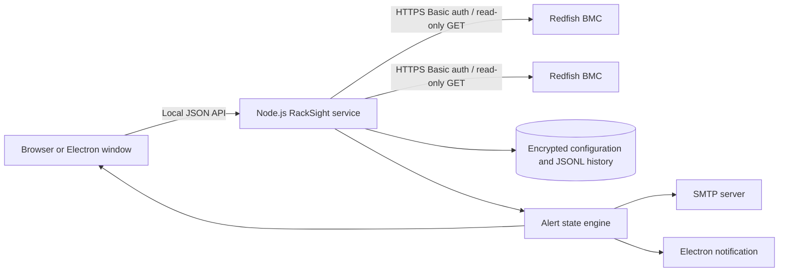

# RackSight architecture

RackSight is a local-first monitoring application. It can run as a Node.js web service or inside Electron. It does not require a cloud service or database.

## Components

- `server.js` serves the static UI, local JSON API, Redfish collector, history worker, encryption, alert state machine, and SMTP delivery.
- `public/` contains the dependency-free browser interface and chart renderer.
- `electron/main.js` starts the service on a random loopback port, hosts it in a sandboxed `BrowserWindow`, manages the tray, and displays native notifications.
- `data/` contains runtime state for web mode. Electron redirects this directory into its per-user application-data location.

## Collection flow

1. A configured server is loaded from the encrypted credential store.
2. RackSight requests the Redfish service root and follows advertised `Systems`, `Chassis`, `Managers`, and update-service links.
3. Collection member requests run with a four-request concurrency limit and one retry for transient failures.
4. Vendor payloads are normalized into one dashboard response.
5. A compact snapshot is appended to the server's JSONL history at the configured interval.
6. Physical temperature readings are evaluated by the persistent alert state machine.
7. A sustained breach creates an event and can trigger browser, Electron, and SMTP notifications. A return below threshold creates a recovery event.

RackSight caches a successful collection briefly so simultaneous UI, history, and alert requests do not repeatedly load the BMC.

## Storage model

| File | Purpose | Protection |
| --- | --- | --- |
| `master.key` | Random 256-bit local encryption key | Owner-only permissions where supported; never commit or share. |
| `servers.enc.json` | BMC addresses, usernames, and passwords | AES-256-GCM encrypted. |
| `smtp.enc.json` | SMTP configuration and password | AES-256-GCM encrypted. |
| `alert-settings.json` | Non-secret threshold and notification preferences | Plain JSON. |
| `alert-state.json` | Pending and firing alert state | Plain JSON. |
| `alert-events.jsonl` | Fired and recovery event journal | Plain JSONL. |
| `history/<id>.jsonl` | Compact telemetry snapshots | Plain JSONL, retained for 31 days. |

When `DASHBOARD_SECRET` is set, RackSight derives the encryption key from that value. Otherwise it uses `master.key`.

## Trust boundaries

- The local API trusts any client that can connect to its listening address. It has no built-in login or authorization layer.
- BMC credentials are decrypted only in the Node.js process and are never returned by the API.
- Self-signed BMC TLS certificates are accepted by default for common management-network deployments. Set `ALLOW_SELF_SIGNED=false` to enforce normal certificate validation.
- SMTP traffic uses the configured transport. Use port 465 with secure mode or port 587 with STARTTLS according to the mail provider's requirements.

## Scaling characteristics

RackSight targets small and medium internal fleets. It polls each configured BMC every 60 seconds by default and stores local JSONL files. It is not a clustered service, distributed time-series database, or replacement for enterprise monitoring platforms.
